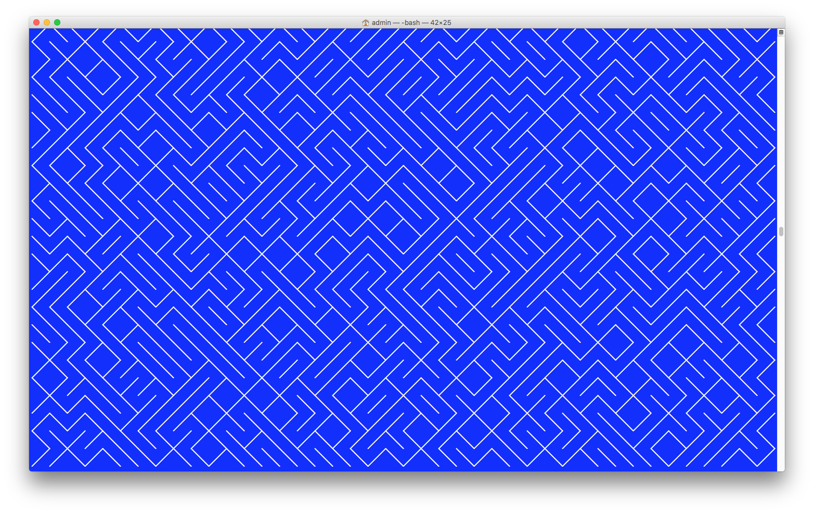
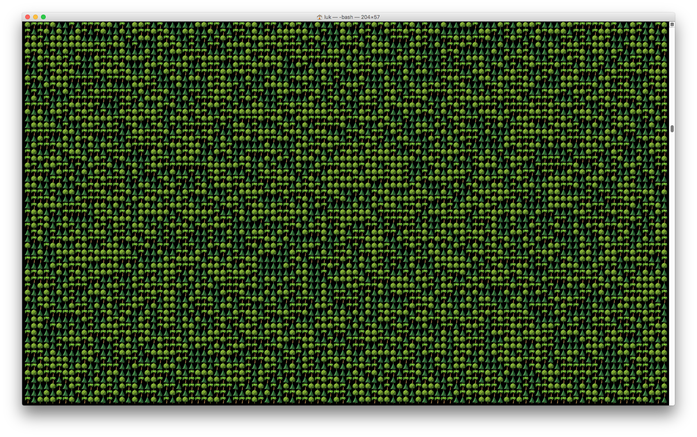

# Patterns in macOS Terminal

Shortest one-line version for Bash:

````yes 'c=(╱ ╲);printf ${c[RANDOM%2]}'|bash````


***

````c=($’⫸’ $’⫷’); n=${#c[@]}; clear; while :; do printf -- "${c[RANDOM%n]}"; done;````


***

````c=($'🌴' $'🌲' $'🌳'); n=${#c[@]}; clear; while :; do printf -- "${c[RANDOM%n]}"; done;````



***

>GOOD TO KNOW:  
>Change **background color** via File > Settings > Profiles > Background.  
>Change **font color**, **character spacing** and **line height** via File > Settings > Profiles > Font/Typography.

***
Text-to-speech output with `say` command. Use `-rXXX` to specify rate/speed.   
````c=($'n' $'s'); n=${#c[@]}; clear; while :; do say -r400 "${c[RANDOM%n]}"; done;````

***
Text-to-speech is even funnier with emojis. Just copy some lines from an output from above.  
````say -r600 🌲🌲🌳🌳🌲🌳🌲🌲🌴🌳🌲🌳🌴🌳🌴🌳🌴````
***
## Image to Audio
By using a spectrogram player like one of the following, you can listen to your patterns!  
- [Image to Audio, Spectrogram Player](https://nsspot.herokuapp.com/imagetoaudio/)  
- [Photosounder](https://www.photosounder.com/)  

or let in analyze by AI:  
- [Imaginary Soundscape](http://www.imaginarysoundscape.net/) 


## Windows PowerShell

Definitely not as funny on Windows as on Mac because PowerShell lacks displaying emojis and text-to-speech is not preinstalled.

Shortest one-line version of "10 Print Chr$(..." for PowerShell:

````for(){Write-Host(Random("\","/"))-N}````
